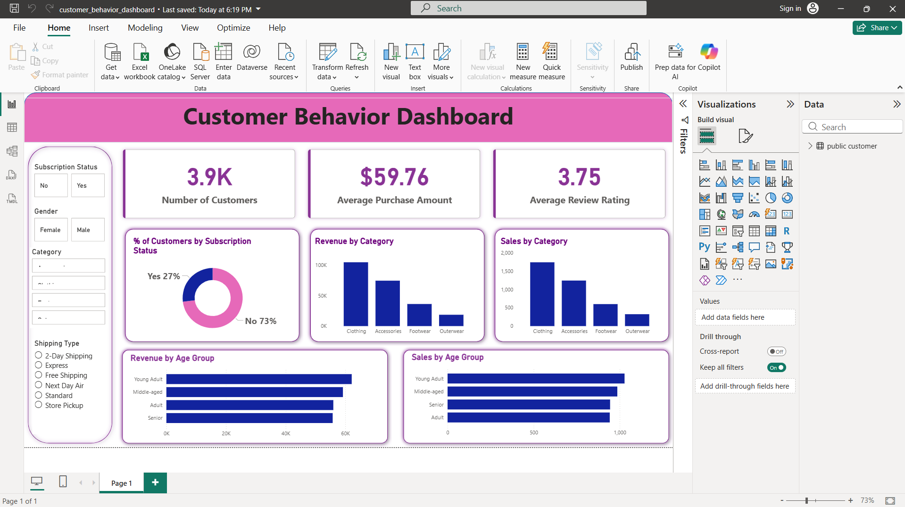

# 🛍️ Customer Segmentation Using Behavioral and Purchase Data

A multi-tool data analytics project that combines **SQL**, **Python**, and **Power BI** to analyze customer shopping behavior, segment customers, and uncover actionable business insights.

---

## 📌 Project Overview

This project explores a customer shopping dataset to understand purchasing patterns, revenue drivers, and customer segments. The analysis is performed end-to-end — from raw data querying in SQL, to exploratory analysis in Python, to interactive dashboards in Power BI.

---

## 🗂️ Project Structure

| File | Description |
|------|-------------|
| `Customer_Shopping_Behavior_Analysis.ipynb` | Jupyter Notebook — data cleaning, EDA, and visualizations |
| `customer_behavior_sql_queries.sql` | SQL queries for data extraction, aggregation, and segmentation |
| `customer_behavior_dashboard.pbix` | Power BI dashboard for interactive visual reporting |

---

## 🛠️ Tools & Technologies

### 🐍 Python (Jupyter Notebook)
- **pandas** — Data loading, cleaning, and transformation
- **matplotlib / seaborn** — Data visualization and chart generation
- **Jupyter Notebook / VS Code** — Interactive development environment

### 🗃️ SQL (PostgreSQL)
- Data querying and aggregation
- Window functions (`ROW_NUMBER`, `PARTITION BY`)
- CTEs (Common Table Expressions)
- Conditional aggregation (`CASE WHEN`)
- Subqueries

### 📊 Power BI
- `.pbix` dashboard for interactive business reporting
- Visual breakdowns of revenue, product performance, and customer segments

---

## 🔍 What Was Done

### 1. SQL Analysis — `customer_behavior_sql_queries.sql`

Ten business questions were answered using structured SQL queries:

| # | Question |
|---|----------|
| Q1 | Total revenue by gender |
| Q2 | Customers who used discounts but still spent above average |
| Q3 | Top 5 products by average review rating |
| Q4 | Average purchase amount by shipping type (Standard vs Express) |
| Q5 | Revenue and average spend comparison — subscribers vs non-subscribers |
| Q6 | Top 5 products with the highest discount application rate |
| Q7 | Customer segmentation: **New**, **Returning**, **Loyal** (based on previous purchases) |
| Q8 | Top 3 most purchased products within each category (using window functions) |
| Q9 | Correlation between repeat buying (>5 purchases) and subscription status |
| Q10 | Revenue contribution by age group |

### 2. Python Analysis — `Customer_Shopping_Behavior_Analysis.ipynb`

- **Data Cleaning & Preprocessing** — handled missing values, corrected data types, standardized columns
- **Exploratory Data Analysis (EDA)** — distribution plots, correlation checks, and frequency analysis
- **Customer Behavior Visualizations** — charts showing purchase trends, product popularity, seasonal patterns
- **Insights & Recommendations** — findings summarized based on data trends

### 3. Power BI Dashboard — `customer_behavior_dashboard.pbix`

- Interactive visual report covering key KPIs
- Revenue breakdowns by gender, age group, and product category
- Subscription and discount impact analysis
- Customer segment distribution visuals

---

## 📈 Key Insights

- **Loyal customers** (more than 10 previous purchases) make up a significant portion of total revenue
- **Subscribed customers** tend to have higher average spend compared to non-subscribers
- Certain product categories have a disproportionately high discount usage rate
- **Age group revenue contribution** varies notably, with middle-aged groups driving the highest spend
- **Standard shipping** dominates in volume, while **Express shipping** correlates with higher-value orders

---

## ▶️ How to Run

### Python Notebook
1. Clone the repository
2. Install dependencies:
   ```bash
   pip install pandas matplotlib seaborn jupyter
   ```
3. Open `Customer_Shopping_Behavior_Analysis.ipynb` in Jupyter Lab or VS Code
4. Run all cells

### SQL Queries
1. Load your customer dataset into a PostgreSQL database (table name: `customer`)
2. Open `customer_behavior_sql_queries.sql` in your SQL client
3. Run individual queries as needed

### Power BI Dashboard

1. Open `customer_behavior_dashboard.pbix` in **Power BI Desktop**
2. Update the data source connection if needed
3. Refresh to load your data

#### Power BI Dashboard Preview

<div align="center">
   
</div>

---

## 📋 Requirements

- Python 3.x
- PostgreSQL (or compatible SQL database)
- Power BI Desktop
- Python libraries: `pandas`, `matplotlib`, `seaborn`, `jupyter`

---

## 👤 Author

**Sunil T Kumar**
[GitHub Profile](https://github.com/Suniltkumartsk)

---

## 📄 License

This project is for educational and portfolio purposes.
